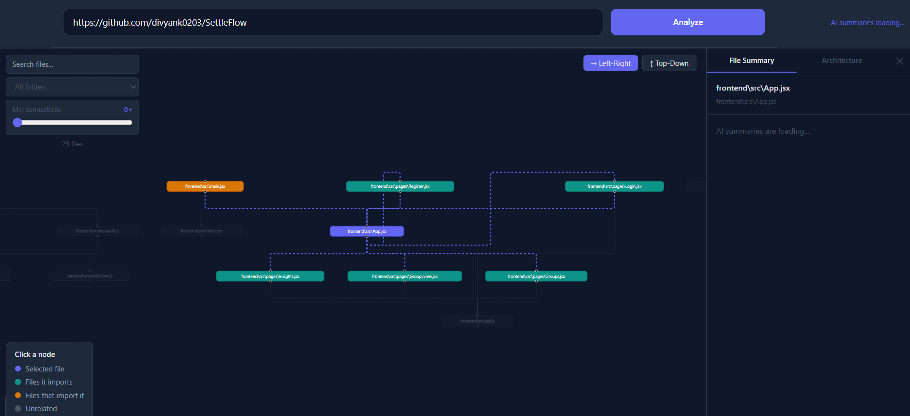

# RepoLens

> Visualize and understand any JS/TS GitHub codebase in minutes.

RepoLens clones a public Javascript or Typescript GitHub repository, maps its dependency graph, and uses AI to explain what every file does — so you can understand an unfamiliar codebase before making your first change.

---

## Demo



---

## Features

- **Dependency graph** — visualizes how files import each other using a clean hierarchical layout powered by Dagre
- **Click to explore** — click any node to highlight its direct imports and dependents instantly
- **Entry point detection** — automatically identifies where execution starts using `package.json`, common filenames (`index.js`, `main.ts`, `server.js`), and structural heuristics
- **AI file summaries** — every JS/TS file gets a concise summary powered by Groq (LLaMA 3.1)
- **Architecture overview** — a single high-level explanation of how the entire codebase is structured
- **Search and filter** — search by filename, filter by folder, or isolate highly-connected hub files
- **Layout toggle** — switch between top-down and left-right graph layouts

---

## Tech Stack

| Layer | Technology |
|---|---|
| Frontend | React 18, Vite, React Flow |
| Graph layout | Dagre |
| Backend | Node.js, Express |
| Repo cloning | simple-git |
| AST parsing | @babel/parser |
| AI pipeline | Groq API (llama-3.1-8b-instant) |

---

## How It Works

```
GitHub URL
    ↓
Clone repo locally (simple-git, shallow clone)
    ↓
Scan file tree — ignore node_modules, .git, dist, build
    ↓
Parse every JS/TS file with @babel/parser → extract all imports
    ↓
Build dependency map  { "fileA.js": ["fileB.js", "fileC.js"] }
    ↓
Detect entry points (package.json + filename heuristics + graph structure)
    ↓
React Flow + Dagre → render interactive dependency graph
    ↓
AI pipeline runs in background (capped at 20 files, max 50kb each):
  chunk large files → summarize each file → synthesize architecture overview
    ↓
Side panel shows per-file summaries + architecture overview on demand
```

---

## Getting Started

### Prerequisites

- Node.js 18+
- Git installed on your system
- A free Groq API key — get one at [console.groq.com](https://console.groq.com) (no credit card required)

### 1. Clone the repo

```bash
git clone https://github.com/divyank0203/Repolens.git
cd Repolens
```

### 2. Backend setup

```bash
cd backend
npm install
```

Create a `.env` file inside the `backend/` folder:

```
GROQ_API_KEY=your_key_here
```

Start the backend:

```bash
node index.js
```

Backend runs on `http://localhost:3001`

### 3. Frontend setup

Open a new terminal:

```bash
cd frontend
npm install
npm run dev
```

Frontend runs on `http://localhost:5173`

### 4. Analyze a repo

Open `http://localhost:5173`, paste any public Javascript or Typescript GitHub URL, and click **Analyze**.

The dependency graph loads in 10–30 seconds. AI summaries load in the background — typically 1–2 minutes for a 20-file repo.

---

## Project Structure

```
Repolens/
├── backend/
│   ├── index.js                      # Express entry point
│   ├── .env                          # API keys (not committed)
│   ├── routes/
│   │   └── repo.js                   # All API route handlers
│   └── services/
│       ├── cloneRepo.js              # Clones GitHub repos via simple-git
│       ├── scanDirectory.js          # Recursive file tree extraction
│       ├── parseFile.js              # AST-based import extraction
│       ├── buildDependencyMap.js     # Assembles the full dependency map
│       ├── detectEntryPoints.js      # Entry point detection heuristics
│       ├── chunkFile.js              # Splits large files for AI context limits
│       ├── summarizeFile.js          # Per-file Groq summarization
│       ├── synthesizeSummaries.js    # Final architecture synthesis call
│       └── runAnalysisPipeline.js    # Orchestrates the full AI pipeline
└── frontend/
    └── src/
        ├── App.jsx                   # Root — owns all state and data fetching
        └── components/
            ├── RepoInput.jsx         # URL input bar
            ├── DependencyGraph.jsx   # React Flow canvas + interaction logic
            ├── SummaryPanel.jsx      # Sliding side panel with tabs
            ├── SearchFilter.jsx      # Search, folder filter, connectivity filter
            └── transformToGraph.js   # Converts dependency map → React Flow nodes/edges
```

---

## API Reference

All endpoints accept `POST` with body `{ "repoUrl": "https://github.com/user/repo" }`.

| Endpoint | Description | Response |
|---|---|---|
| `POST /api/repo` | Clone and return file tree | `{ tree }` |
| `POST /api/repo/analyze` | Dependency map + entry points | `{ tree, dependencyMap, entryPoints }` |
| `POST /api/repo/summary` | Full AI pipeline | `{ fileSummaries, architectureOverview }` |

---

## AI Pipeline Design

The AI pipeline uses **prompt chaining** — a sequence of LLM calls where the output of one becomes the input of the next, rather than sending the entire codebase in a single prompt.

```
Stage 1  Read and chunk files (max 300 lines per chunk, skip files > 50kb)
Stage 2  Summarize each file individually (parallel, batched at 3 concurrent)
Stage 3  Group file summaries by folder (pure data transform, no LLM)
Stage 4  Single synthesis call → architecture overview
```

**Why Groq over Gemini:** Groq's free tier has no restrictive daily request cap, making it practical for analyzing real repos. The pipeline uses `llama-3.1-8b-instant` which is fast and produces good code summaries. If Groq rate limits are hit, the pipeline automatically reads the suggested retry delay from the error response and waits exactly that long before retrying — no wasted time from fixed backoff guesses.

**File caps:** The pipeline analyzes up to 20 files per run and skips files over 50kb (typically generated or minified code). This keeps each analysis fast and within API limits.

---

## Limitations

- Public GitHub repos only (no auth support)
- JS and TypeScript files only (`.js`, `.jsx`, `.ts`, `.tsx`, `.mjs`)
- AI pipeline analyzes up to 20 files per run (largest files by relevance)
- Groq free tier has per-minute rate limits — large repos may take 2–3 minutes due to automatic retry/backoff

---
